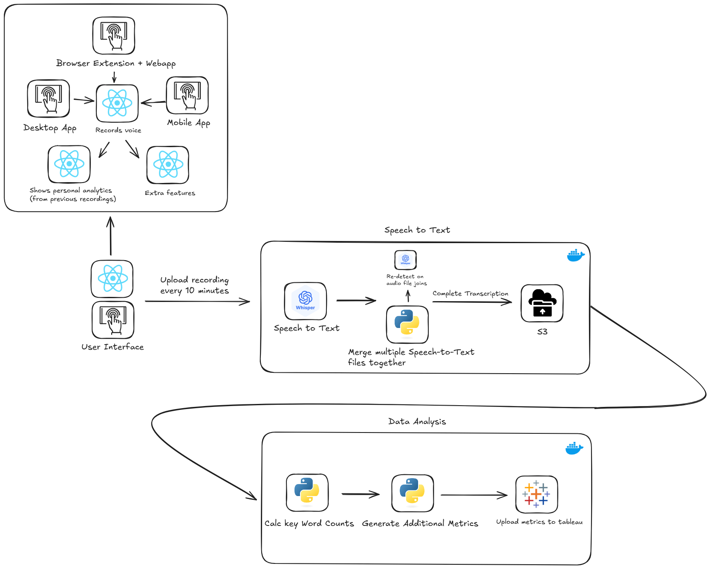

# TeachSpeak-AI

Our attempt at a machine learning model which usings ai to tally up specific key words a education professional says in order to improve their ability and the classroom environment.

## Software Design

## File Structure
<pre>
.
└── teach-speak-ai/
    ├── backend/
    │   ├── speech-to-text/
    │   │   ├── Dockerfile
    │   │   ├── requirements.txt
    │   │   ├── src/
    │   │   │   └── ...
    │   │   └── tests/
    │   │       └── ...
    │   ├── data-analysis/
    │   │   ├── Dockerfile
    │   │   ├── requirements.txt
    │   │   ├── src/
    │   │   │   └── ...
    │   │   └── tests/
    │   │       └── ...
    │   ├── docker-compose.yml
    │   └── ...
    ├── frontend/
    │   ├── desktop-app/
    │   │   ├── ...
    │   │   └── src/
    │   │       └── ...
    │   ├── mobile-app/
    │   │   ├── ...
    │   │   └── src/
    │   │       └── ...
    │   └── web-app/
    │       ├── browser-extensionn/
    │       │   ├── ...
    │       │   └── src/
    │       │       └── ...
    │       ├── ...
    │       └── src/
    │           └── ...
    ├── infrastructure/
    │   └── ...
    ├── assets/
    │   └── ...
    ├── README.md
    └── .gitignore
</pre>
